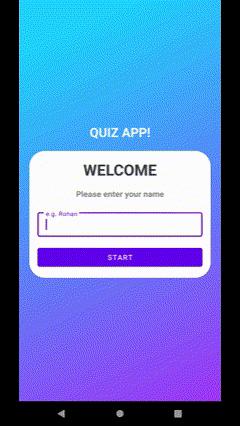
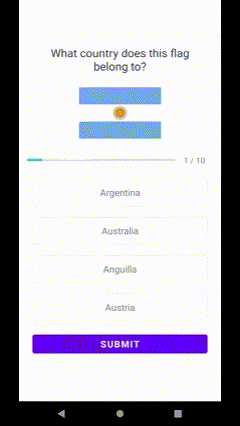

# Quiz App

## Overview

Welcome to Quiz App! This Android application is designed to test your knowledge of world flags in a fun and engaging way. It combines a personalized experience with a flag quiz, challenging you to match flags with their respective countries. With a fixed order of 10 flags in each quiz, you can track your progress and see how well you perform.

Whether you're a geography enthusiast looking to expand your flag knowledge or just someone looking for an enjoyable quiz, Quiz App has you covered. Get started by entering your name and dive into the world of flags!

## Screenshots

### Name Input

*Enter your name to personalize the quiz.*

### Flag Quiz in Progress

*Select the correct country name and tap "Submit" to evaluate your answer.*

### Final Score

*View your final score after completing the quiz.*

